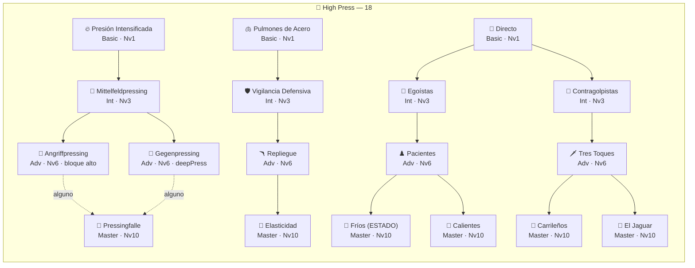
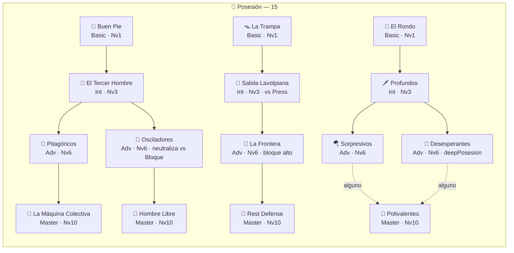
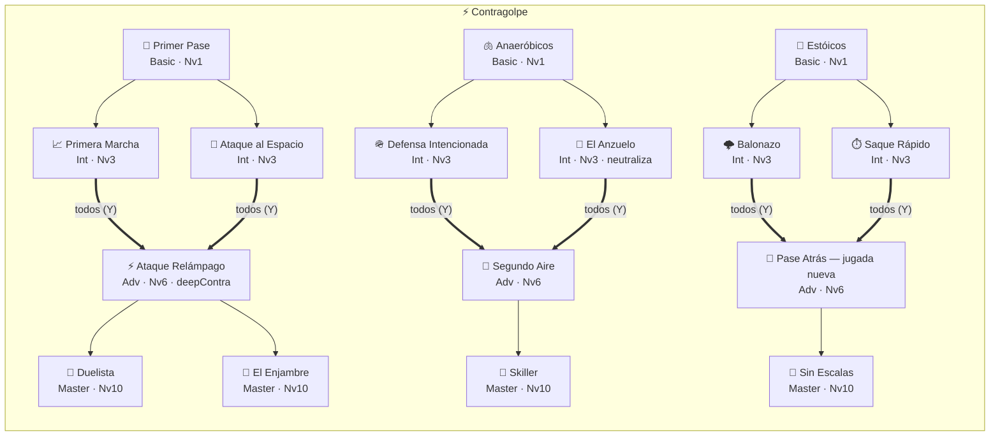
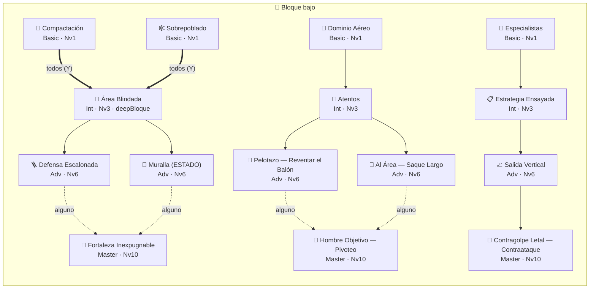

# Catálogo de Rasgos — el árbol de identidad completo

Documento de referencia del arco de Rasgos (T1–T3, cerrado 23-jul-2026). Lista los
rasgos vivos con su efecto mecánico ("buff"), su costo/tradeoff real, y el árbol de
dependencias para desbloquear cada uno. Diseño narrativo completo en
[ROADMAP-rasgos.md](ROADMAP-rasgos.md); datos fuente en
[content/traits/](../js/content/traits/).

> ✅ **Al día con el código al 1-ago-2026** (64 rasgos: Press 18 · Posesión 15 ·
> Contragolpe 16 · Bloque bajo 15), regenerado desde
> [content/traits/](../js/content/traits/), que es siempre la fuente de verdad.
> *Historia: las cuatro filosofías se rediseñaron DESPUÉS de cerrar el arco T1-T3, y este
> documento quedó describiendo el árbol viejo de 9 nodos para Press y Posesión hasta que se
> regeneró.*

## Cómo leer esto

- **Precio uniforme**: todo rasgo cuesta **1 Punto de Identidad (PI)**, sin excepción.
  Lo que cambia entre tiers no es el precio — son los **requisitos** para que el candado
  se abra.
- **PI se gana** subiendo de nivel la filosofía **activa** (1 PI por nivel, 10 niveles
  posibles). Cambiar de filosofía **no** imprime PI de la herencia (anti-farming): solo
  jugar la identidad que tienes puesta paga.
- **Los candados vivos son DOS**: el **rasgo previo** en la rama (`previo`, o `alguno` de
  dos cuando la rama se bifurca) y el **nivel de la filosofía** — 1 · 3 · 6 · 10 para
  Basic · Intermediate · Advanced · Master. Más el PI.
  > ⚠️ Los **"Principios mínimos"** del GDD §5 **murieron** con las aristas en el arco de
  > Progresión. Ningún rasgo del juego los pide hoy. Si ves esa condición mencionada en un
  > comentario del código o en un roadmap viejo, está desactualizada.
- **El tradeoff real no es un "debuff"**: por regla de diseño, ningún rasgo resta
  estadísticas. El costo verdadero es **de oportunidad**:
  - **El nivel 10 es carísimo**: el Master exige Consolidada, y toda la Sesión Táctica de
    la run tiene que apuntar a un solo lado. Medido: el DT al azar llega al Master en
    ~2.7% de las runs; el que invierte con criterio, en ~99.8%.
  - **Rasgos de ESTADO**: algunos (Muralla, Fríos) solo funcionan bajo una condición del
    partido — fuera de ella, no aportan nada.
  - **Neutralizar, no invertir**: los que responden a un matchup débil llevan la cuota de
    esa jugada de vuelta a la referencia neutra — nunca la superan.

> 🔤 **DEUDA abierta (detectada 1-ago-2026): el árbol de Posesión está escrito SIN TILDES.**
> Son **20 campos que ve el jugador** — `nombre`, `desc`, `momento` y textos de hook:
> `Pitagoricos`, `La Maquina Colectiva`, "presion", "linea", "atras", "vacia", "ahi",
> "habia", "triangulacion", "aereo", "posesion", "transicion". Las otras tres filosofías
> están bien escritas (`Presión Intensificada`, `Compactación`, `Egoístas`, `Estóicos`), así
> que se ve que ese bloque se tipeó de corrido sin acentos. **No confundir con los
> identificadores internos** (`to: "recuperacion"`, `of: "transicion"`), que van sin tilde a
> propósito y NO se muestran. Pendiente de ok del PO por ser copy de cara al jugador.

## Las 5 aristas (para leer de qué está hecha cada filosofía)

Ya **no gatean rasgos** — hoy solo componen la identidad y su nivel (`content/philosophies`).
Se dejan porque explican por qué cada árbol juega a lo que juega.

| Icono | Arista | Filosofías que la llevan |
|---|---|---|
| 🦁 | Presión | High Press, Posesión |
| 🎼 | Elaboración | Posesión |
| ⚡ | Verticalidad | High Press, Contragolpe |
| 🧱 | Solidez | Contragolpe, Bloque bajo |
| 🌩️ | Juego directo | Bloque bajo |

---

## 🦁 High Press — *"Cazar arriba y atacar el espacio antes de que el rival respire."*

**Fuerte:** brilla contra el que quiere la pelota (Posesión) · **Advertencia:** correr 90'
cansa físicamente, y el pelotazo por arriba sobre la presión te parte.

Árbol de **18 rasgos** — el más grande del juego (rediseño del 25-jul-2026). Su rama de
**Expansión es la más ancha**: cuatro Masters distintos, dos por cada Advanced.

| Rama | Tier | Rasgo | Qué cambia en el partido | Requisitos |
|---|---|---|---|---|
| Firma | Basic | 🔥 Presión Intensificada | 28% de que el acierto de la presión convierta directo en recuperación: presionar deja de ser recurso y pasa a ser la primera opción. | Nivel 1. |
| Firma | Intermediate | 🧲 Mittelfeldpressing | La línea se planta en el círculo central: más recuperaciones en el pool (×1.22). | Nivel 3 + Presión Intensificada. |
| Firma | Advanced | 🦁 Angriffpressing | 45% de que la recuperación nazca profunda (robo sobre el saque de meta). **Exige BLOQUE ALTO** (altura ≥4): no se salta desde el propio área. | Nivel 6 + Mittelfeldpressing. |
| Firma | Advanced | 🐺 Gegenpressing | 30% de cazar la pelota en los 5" siguientes a perderla + **migración F2** del Press. | Nivel 6 + Mittelfeldpressing. |
| Firma | Master | 👑 Pressingfalle | Toda la familia de la recuperación define mejor (+0.07) y la trampa caza más seguido (chainPlus +0.12). | Nivel 10 + Angriffpressing **o** Gegenpressing. |
| Respuesta | Basic | 🫁 Pulmones de Acero | El botón de presión cuesta 15% menos energía: se presiona igual de arriba en el minuto 80. | Nivel 1. |
| Respuesta | Intermediate | 🛡️ Vigilancia Defensiva | 40% de cortar el pelotazo a la espalda ANTES de que se vuelva mano a mano. | Nivel 3 + Pulmones de Acero. |
| Respuesta | Advanced | 🪃 Repliegue | La contra rival remata desde donde no se hace gol (−0.06 a su remate en transición). | Nivel 6 + Vigilancia Defensiva. |
| Respuesta | Master | 👑 Elasticidad | 32% de que el repliegue contenido se convierta en recuperación mía: cortar y volver a estar arriba en diez segundos. | Nivel 10 + Repliegue. |
| Expansión | Basic | 🎯 Directo | 26% de que la recuperación se saltee los actos intermedios: robo y pase al espacio en el mismo movimiento. | Nivel 1. |
| Expansión | Intermediate | 🧊 Egoístas | 35% de reciclar la posesión cuando el pase se intercepta: recuperada, la pelota se esconde. | Nivel 3 + Directo. |
| Expansión | Intermediate | 🏇 Contragolpistas | 28% de que el rechace de un duelo aéreo perdido lance transición mía. | Nivel 3 + Directo. |
| Expansión | Advanced | ♟️ Pacientes | El "buscar al mejor ubicado" del desenlace mejora (+0.05): el pase de gol sin apuro. | Nivel 6 + Egoístas. |
| Expansión | Advanced | 🗡️ Tres Toques | El salto directo al desenlace llega mejor (+0.06): robo, pase, gol en ocho segundos. | Nivel 6 + Contragolpistas. |
| Expansión | Master | 👑 Fríos | **Rasgo de ESTADO**: desde el 70' y sin ir perdiendo, aparece la opción "congelar" en el desenlace — se resigna la ocasión propia y se le **descuenta una llegada al rival**. | Nivel 10 + Pacientes. |
| Expansión | Master | 👑 Calientes | El rival se repliega más (×1.28 en su pool): diez minutos metido en su área. | Nivel 10 + Pacientes. |
| Expansión | Master | 👑 Carrileños | El desenlace de la transición llega en su versión profunda (+0.06): el centro del lateral que arrancó de su propia área. | Nivel 10 + Tres Toques. |
| Expansión | Master | 👑 El Jaguar | 28% de que el desenlace de la transición se acelere al mano a mano (+0.06). | Nivel 10 + Tres Toques. |

> ✅ **Deuda saldada (verificado 6-ago-2026): `iceGame` (Fríos) SÍ está implementado.**
> `canFreeze` (acts/common.js) lo gatea al 70' sin ir perdiendo, `resolveFinish` ofrece
> la opción "congelar" y `maybeStartSequence` descuenta la llegada rival con `_frozen`.
> Este aviso decía lo contrario y quedó viejo.

---

## 🎼 Posesión — *"Tener la pelota es atacar y defender a la vez; si se pierde, se caza al toque."*

**Fuerte:** domina los partidos (más circulación, contrapressing) · **Advertencia:** se
estrella contra un bloque bajo bien plantado.

Árbol de **15 rasgos** (rediseño del 26-jul-2026). Es el único con **dos Masters en la
Firma**, y su rama de Respuesta es la que carga la neutralización del matchup débil.

| Rama | Tier | Rasgo | Qué cambia en el partido | Requisitos |
|---|---|---|---|---|
| Firma | Basic | 🦶 Buen Pie | 35% de reciclar la posesión cuando el pase se intercepta: la jugada no se muere ahí. | Nivel 1. |
| Firma | Intermediate | 🔺 El Tercer Hombre | 40% de rescatar la salida bajo presión cuando el pase falla — sin regalar el remate. | Nivel 3 + Buen Pie. |
| Firma | Advanced | 📐 Pitagóricos | El desenlace busca al mejor ubicado de verdad, no al más cercano (+0.05). | Nivel 6 + El Tercer Hombre. |
| Firma | Advanced | 🌊 Osciladores | **Neutralización del matchup**: solo vs 🦁 Press, circulación ×1.39 — la celda vuelve a tablas, nunca la supera. *(corregido 6-ago-2026: el texto viejo decía "vs Bloque, ×1.54 y pelotazo ×0.77"; el hook dice `vsFilo: "press"`, `circulacion: 1.39`).* | Nivel 6 + El Tercer Hombre. |
| Firma | Master | 👑 La Máquina Colectiva | El reparto de iniciativa se inclina de raíz (+0.06) **y** 38% de "pelota servida" cerca del área (+0.22): el gol a puerta vacía tras treinta pases. | Nivel 10 + Pitagóricos. |
| Firma | Master | 👑 Hombre Libre | 30% de que el desenlace de la circulación se acelere (+0.06): veinte pases y el nueve de cara al arquero. | Nivel 10 + Osciladores. |
| Respuesta | Basic | 🪤 La Trampa | Cuando el rival recupera está lejos y su remate no asusta (−0.06) + devolverla atrás para sacarlo de su bloque (+0.06, solo ya adelantado). | Nivel 1. |
| Respuesta | Intermediate | 🧩 Salida Lavolpiana | Variante de circulación **solo vs Press**: 30% de arrancar ya saltando su primera línea (+0.07). | Nivel 3 + La Trampa. |
| Respuesta | Advanced | 🚩 La Frontera | 40% de cortar el pelotazo a la espalda + 50% de anular la contra por **offside**. **Exige BLOQUE ALTO** (altura ≥4): sin línea adelantada no hay trampa. | Nivel 6 + Salida Lavolpiana. |
| Respuesta | Master | 👑 Rest Defense | 36% de que la secuencia rival pierda continuidad antes de llegar al área: recuperan, miran arriba y no hay a quién pasarla. | Nivel 10 + La Frontera. |
| Expansión | Basic | 🔄 El Rondo | Más circulación en el pool (×1.2) **y el rival se cansa más** (×1.1): diez minutos de toque en campo rival. | Nivel 1. |
| Expansión | Intermediate | 🗡 Profundos | 26% de que la circulación se saltee los actos intermedios: el filtrado que parte a la defensa tras veinte toques. | Nivel 3 + El Rondo. |
| Expansión | Advanced | 🪂 Sorpresivos | 30% de que la circulación nazca en su variante profunda (+0.06): el pelotazo aéreo tras cuarenta toques. | Nivel 6 + Profundos. |
| Expansión | Advanced | 😤 Desesperantes | **Migración F2** de Posesión: la sinfonía gana su 4º compás y el penal profundo. | Nivel 6 + Profundos. |
| Expansión | Master | 👑 Polivalentes | El reciclaje se vuelve estructural: hasta 2 veces por jugada, al 60%. | Nivel 10 + Sorpresivos **o** Desesperantes. |

---

## ⚡ Contragolpe — *"Orden atrás, y a la que pierden la pelota: puñalada al espacio."* — **REDISEÑADO 30-jul-2026**

**Fuerte:** vive del rival que ataca (cada avance suyo es una contra en potencia) ·
**Advertencia:** cede la iniciativa — contra otro que también espera, el partido se muere.

Árbol de **16 rasgos** en grafo. Es el más caro del juego: **las tres avanzadas piden
DOS padres** (convergencia Y), así que cada rama cuesta 5 PI hasta su Maestría.

| Rama | Tier | Rasgo | Buff (qué cambia en el partido) | Requisitos |
|---|---|---|---|---|
| Firma | Basic | 📡 Primer Pase | El acto que LANZA la contra sale +0.05. Los tres rasgos del pase de la contra se apilan. | Nivel 1. |
| Firma | Intermediate | 📈 Primera Marcha | Todos los actos de la contra salen +0.05 (ya en carrera, el equipo se entiende). | Nivel 3 + Primer Pase. |
| Firma | Intermediate | 🏃 Ataque al Espacio | El "buscar al mejor ubicado" del desenlace de la contra gana +0.06: los desmarques parten a la defensa. | Nivel 3 + Primer Pase. |
| Firma | Advanced | ⚡ Ataque Relámpago | 30% de saltar directo al desenlace (la contra a una) + **migración F2**: profundiza el 1er tramo del Contragolpe letal. | Nivel 6 + Primera Marcha **y** Ataque al Espacio. |
| Firma | Master | 👑 Duelista | 30% de que el desenlace de la contra se acelere hasta el mano a mano con el arquero (+0.07). | Nivel 10 + Ataque Relámpago. |
| Firma | Master | 👑 El Enjambre | El pase encuentra al MEJOR rematador real (+0.05) **y** toda la contra llega en oleada (+0.06). | Nivel 10 + Ataque Relámpago. |
| Respuesta | Basic | 🫁 Anaeróbicos | El botón de presión cuesta 15% menos energía (se apila con Pulmones de Acero del Press). ⚠️ *Adyacente: ver deuda abajo.* | Nivel 1. |
| Respuesta | Intermediate | 🪖 Defensa Intencionada | 30% de que el córner rival defendido de cabeza encadene contra mía. | Nivel 3 + Anaeróbicos. |
| Respuesta | Intermediate | 🎣 El Anzuelo | El rival sale a presionar mi salida más seguido (×1.20) — y sobrevivirla ES una contra + **neutralización** del partido muerto (transición ×1.67 vs Contra y Bloque ≈ tablas) + 30% de convertir la circulación-cebo. | Nivel 3 + Anaeróbicos. |
| Respuesta | Advanced | 💨 Segundo Aire | Conducir la contra con menos de 50 de energía gana +0.08. ⚠️ *Adyacente: ver deuda abajo.* | Nivel 6 + Defensa Intencionada **y** El Anzuelo. |
| Respuesta | Master | 👑 Skiller | Al que conduce la contra le hacen falta más seguido (+0.06 de ventana): más penales y tiros libres. | Nivel 10 + Segundo Aire. |
| Expansión | Basic | 🗿 Estóicos | Replegado, el equipo corta más: +0.05 al acto de contención. | Nivel 1. |
| Expansión | Intermediate | 🌩️ Balonazo | 28% de que la segunda pelota de un duelo aéreo perdido lance la contra. | Nivel 3 + Estóicos. |
| Expansión | Intermediate | ⏱️ Saque Rápido | 30% de que el despeje de la salida asfixiada reinicie rápido y se vuelva contra mía. | Nivel 3 + Estóicos. |
| Expansión | Advanced | 🎯 Pase Atrás | **Jugada nueva**: opción del desenlace de la contra. La pisa y la devuelve al que entra de frente (+0.14). Es un pase de verdad: perderlo abre contra rival. | Nivel 6 + Balonazo **y** Saque Rápido. |
| Expansión | Master | 👑 Sin Escalas | 14% de que la contra NAZCA resuelta: se saltean los actos intermedios y el desenlace es el mano a mano (+0.12). | Nivel 10 + Pase Atrás. |

> ⚠️ **Deuda declarada (sprint de SITUACIONES DE JUEGO).** Anaeróbicos y Segundo Aire
> apuntan a un sustrato que todavía no existe: **correr una contra no cuesta energía**
> (el único gasto que el DT controla es el botón de presión) y la penalización por
> energía es una curva global sin excepciones por jugada. Los dos están implementados
> con el efecto adyacente más cercano y **se reescriben cuando ese sprint construya el
> costo físico del contraataque**.

---

## 🧱 Bloque bajo — *"Muralla atrás y pelotazo al duelo: fútbol de trinchera."* — **REDISEÑADO 30-jul-2026**

**Fuerte:** dificilísimo de romper (invita al rival y lo seca) · **Advertencia:** sufre al
que elabora con paciencia y renuncia a generar volumen ofensivo.

Árbol de **15 rasgos** en grafo (como Press y Posesión). Único del juego con una
convergencia **Y**: la Firma abre con DOS básicos que se compran juntos. Los requisitos
son solo **nivel de la filosofía + 1 PI** (los Principios murieron con las aristas).

| Rama | Tier | Rasgo | Buff (qué cambia en el partido) | Requisitos |
|---|---|---|---|---|
| Firma | Basic | 🏰 Compactación | El remate rival del repliegue llega incómodo (−0.05): cerrado el centro, se remata desde afuera. | Nivel 1. |
| Firma | Basic | 🕸️ Sobrepoblado | 25% de que el avance rival multi-acto muera interceptado antes del remate. | Nivel 1. |
| Firma | Intermediate | 🗿 Área Blindada | **Migración F2 del Bloque**: la fortaleza contiene mejor y castiga más (convert 0.55→0.75) + el remate rival dentro del área sale a destiempo (−0.05). | Nivel 3 + Compactación **y** Sobrepoblado. |
| Firma | Advanced | 🪜 Defensa Escalonada | La PRIMERA ocasión rival del partido llega −0.06. Se consume una vez por partido. | Nivel 6 + Área Blindada. |
| Firma | Advanced | 🧱 Muralla | **Rasgo de ESTADO**: mientras el marcador esté empatado o a favor, el remate rival llega −0.05. Perdiendo no aporta nada. | Nivel 6 + Área Blindada. |
| Firma | Master | 👑 Fortaleza Inexpugnable | 25% de que la **ocasión clara** rival (mano a mano · contra tras mi pérdida) directamente no ocurra + **neutralización** del sitio (repliegue ×0.74 vs Posesión: la celda vuelve a tablas) + frustración acumulada hasta −0.08. | Nivel 10 + Defensa Escalonada **o** Muralla. |
| Respuesta | Basic | 🦅 Dominio Aéreo | El cabezazo rival del córner en contra llega forzado (−0.05). | Nivel 1. |
| Respuesta | Intermediate | 👀 Atentos | La segunda pelota es mía por los dos canales: 30% tras córner defendido y 30% tras duelo aéreo perdido — las dos encadenan pelotazo propio. | Nivel 3 + Dominio Aéreo. |
| Respuesta | Advanced | 🚀 Pelotazo | **Jugada nueva "Reventar el Balón"**: tercera opción del acto de contención. Mata el ataque rival sin remate; el precio es resignar la conversión de la fortaleza y 30% de córner concedido. | Nivel 6 + Atentos. |
| Respuesta | Advanced | 🎪 Al Área | 35% de que el pelotazo sin gol termine en saque largo al área (balón parado encadenado) en vez de morir. | Nivel 6 + Atentos. |
| Respuesta | Master | 👑 Hombre Objetivo | **Jugada nueva "Pivoteo al Área"**: tercera opción del duelo aéreo. El que gana por arriba la baja al mejor rematador, que define de frente (+0.07). | Nivel 10 + Pelotazo **o** Al Área. |
| Expansión | Basic | 📐 Especialistas | El balón parado propio se ejecuta mejor (+0.06). | Nivel 1. |
| Expansión | Intermediate | 📋 Estrategia Ensayada | El balón parado propio SALE más seguido (×1.15 en el pool, apilado sobre el ×1.3 incondicional del Bloque). | Nivel 3 + Especialistas. |
| Expansión | Advanced | 📈 Salida Vertical | Los actos de la familia de la transición salen +0.05: recuperada la pelota, el pase hacia adelante llega. | Nivel 6 + Estrategia Ensayada. |
| Expansión | Master | 👑 Contragolpe Letal | **Jugada nueva "Contraataque"**: 30% de que el repliegue contenido convierta en transición mía. | Nivel 10 + Salida Vertical. |

---

## El árbol de dependencias

Cada filosofía es un árbol independiente de **3 ramas** (Firma · Respuesta · Expansión) que
nacen de su propio Basic y suben en cadena. **No hay convergencia entre ramas**: cada una
llega a su(s) Master por su lado. Tamaños: Press 18 · Contragolpe 16 · Posesión 15 ·
Bloque 15.

*(la flecha punteada `-.->` marca el requisito "alguno de los dos" del Master; el resto
son flechas sólidas de "todos" obligatorios.)*

---

## Costo acumulado de PI (camino mínimo)

Todo rasgo cuesta 1 PI. Como **las ramas no convergen entre sí**, el camino más barato a
cualquier nodo es simplemente **su cadena hacia arriba**: no hace falta comprar las otras
ramas.

| Objetivo | PI acumulados | Qué se compró en el camino |
|---|---|---|
| 1 Basic | **1 PI** | Ese básico. |
| 1 Intermediate | **2 PI** | Su Basic + él. |
| 1 Advanced | **3 PI** | Basic → Intermediate → Advanced. |
| **1 Master** | **4 PI** | Basic → Intermediate → Advanced → Master. |
| 1 Master **con convergencia Y** | **5 PI** | Igual, pero el Advanced pide DOS padres: la Firma del Contragolpe y la del Bloque bajo. |

**El candado caro no es el PI: es el nivel 10** (Consolidada) que exige el Master. En una
run real eso significa toda la Sesión Táctica apuntando a un solo lado, sin desviarse.
**Medido en el gate del arco**: el DT que juega al azar alcanza el Master en ~2.7% de las
runs; el que invierte con criterio (heurística `--focus`), en ~**99.8%**. Es, literalmente,
lo que separa "jugué una run" de "construí una doctrina".

> Con 10 niveles se imprimen **10 PI** por run como máximo. Un árbol completo cuesta entre
> 15 y 18: **ninguna run alcanza para comprarlo entero**, y esa es la decisión del jugador.

---

## Los rasgos con GEOGRAFÍA

Desde que el motor sabe dónde está la pelota, ocho rasgos existen **solo donde su fútbol
existe**. La regla de diseño fue: gatear únicamente lo que el fútbol pide y **compensarle la
frecuencia**, para que el rasgo cambie de carácter y no de valor (el árbol recién calibrado no
se mueve).

| Rasgo | Dónde existe ahora | Compensación |
|---|---|---|
| 🔙 **La Trampa** (retroceso de posesión) | Solo con el equipo ya adelantado (mediocampo en adelante): retroceder desde tu propia salida no saca a nadie de su bloque. | bonus 0.05 → 0.06 |
| 🚀 **Pelotazo Fuera** (reventar el balón) | Solo defendiendo en campo propio. | — (el gate cubre todo el repliegue) |
| 🦁 **Angriffpressing** | Solo con **bloque alto o muy alto**: no se salta sobre el saque de meta desde el propio área. | p 0.35 → 0.45 |
| 🚩 **La Frontera** (trampa del offside) | Solo con **bloque alto o muy alto**: sin línea adelantada no hay trampa que tender. | p 0.35 → 0.50 |
| 🎯 **Hombre Objetivo** (pivotear al área) | Solo cerca del área rival. | bonus 0.07 → 0.08 |
| 🎯 **Al Área** (cabeza de playa) | Solo cerca del área rival. | p 0.35 → 0.42 |
| 🛡️ **Rest Defense** | El corte del avance rival ocurre **antes** de que llegue al área. | p 0.28 → 0.36 |
| 🎼 **La Máquina Colectiva** (pelota servida) | Solo con la circulación ya metida en zona de remate. | p 0.30 → 0.38 |

Los dos gates por **altura de bloque** son los únicos que el jugador necesita leer, y por eso
están escritos en la descripción del rasgo: los demás se explican solos, porque la opción
aparece (o no) en la pizarra del acto correspondiente.

Un rasgo nuevo puede pedir geografía con dos datos en su hook: `zone: [min, max]` (alturas donde
existe) o `minHeight: n` (altura de bloque que exige). Sin ellos, aplica siempre.
