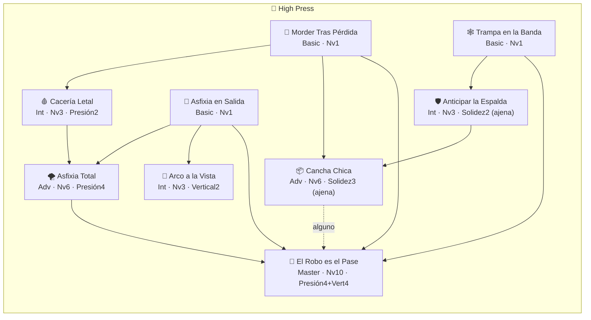
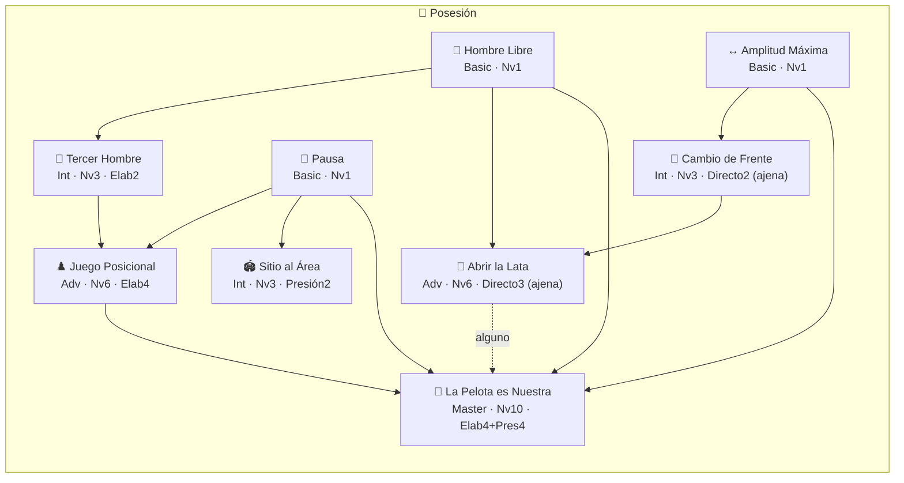
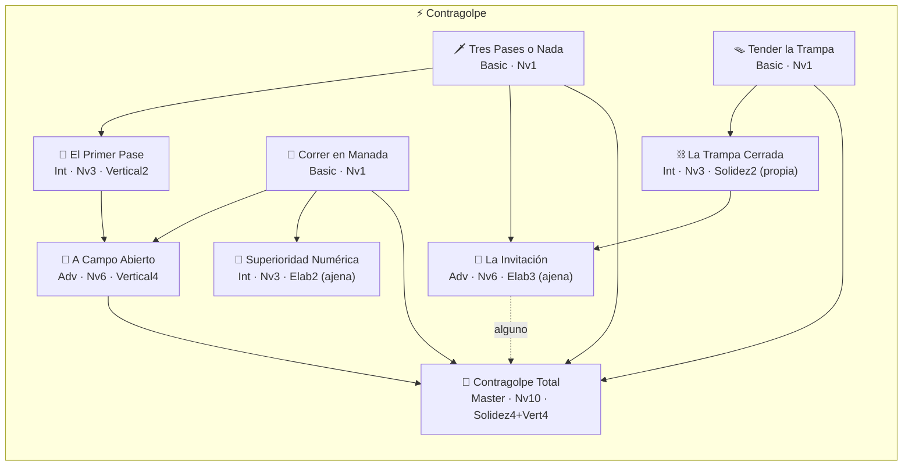
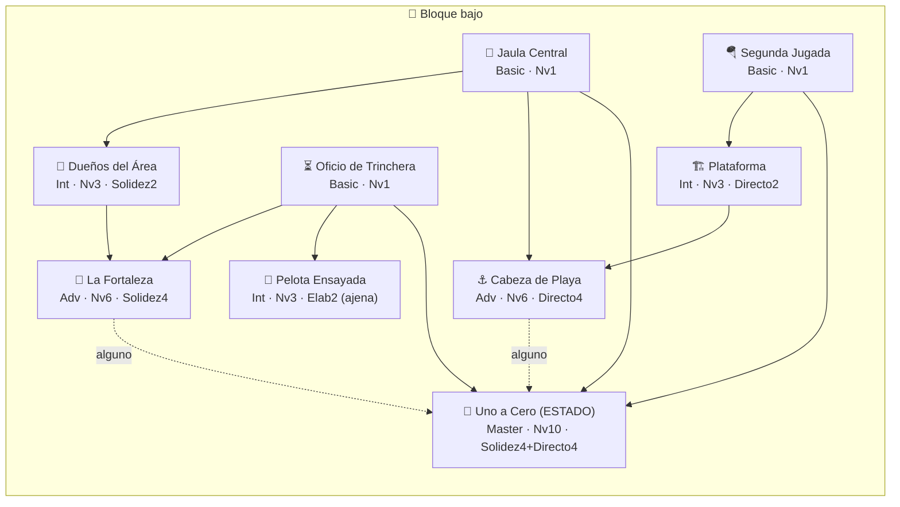

# Catálogo de Rasgos — el árbol de identidad completo

Documento de referencia del arco de Rasgos (T1–T3, cerrado 23-jul-2026). Lista los 36
rasgos vivos con su efecto mecánico ("buff"), su costo/tradeoff real, y el árbol de
dependencias para desbloquear cada uno. Diseño narrativo completo en
[ROADMAP-rasgos.md](ROADMAP-rasgos.md); datos fuente en
[content/traits.js](../js/content/traits.js).

## Cómo leer esto

- **Precio uniforme**: todo rasgo cuesta **1 Punto de Identidad (PI)**, sin excepción.
  Lo que cambia entre tiers no es el precio — son los **requisitos** para que el candado
  se abra.
- **PI se gana** subiendo de nivel la filosofía **activa** (1 PI por nivel, 10 niveles
  posibles). Cambiar de filosofía **no** imprime PI de la herencia (anti-farming): solo
  jugar la identidad que tienes puesta paga.
- **Los 4 tiers y sus 4 candados** (GDD §5): rasgo previo en la rama · Principio(s)
  mínimo(s) · nivel de Filosofía · 1 PI.
- **El tradeoff real no es un "debuff"**: por regla de diseño, ningún rasgo resta
  estadísticas. El costo verdadero es **de oportunidad**:
  - **Principio AJENO**: varios rasgos piden entrenar un Principio que NO es de tu
    filosofía. Como el nivel de identidad se calcula sumando **solo tus 2 Principios
    propios**, entrenar el ajeno no te da PI ni sube tu nivel — es tiempo de juego
    invertido en algo que solo sirve para abrir ESE candado.
  - **Rasgos de ESTADO**: alguno de los Master (Uno a Cero) solo funciona bajo una
    condición del partido (ir ganando) — fuera de ella, no aporta nada.
  - **Neutralizar, no invertir**: los Advanced/algunos que responden a un matchup débil
    llevan la cuota de esa jugada de vuelta a la referencia neutra — nunca la superan.

## Los 5 Principios (para ubicar qué es "propio" y qué es "ajeno")

| Icono | Principio | Filosofías que lo tienen propio |
|---|---|---|
| 🦁 | Presión | High Press, Posesión |
| 🎼 | Elaboración | Posesión |
| ⚡ | Verticalidad | High Press, Contragolpe |
| 🧱 | Solidez | Contragolpe, Bloque bajo |
| 🌩️ | Juego directo | Bloque bajo |

---

## 🦁 High Press — *"Cazar arriba y atacar el espacio antes de que el rival respire."*

**Fuerte:** brilla contra el que quiere la pelota (Posesión) · **Advertencia:** correr 90'
cansa físicamente, y el pelotazo por arriba sobre la presión te parte.

| Rama | Tier | Rasgo | Buff (qué cambia en el partido) | Tradeoff / costo real |
|---|---|---|---|---|
| Firma | Basic | 🐺 Morder Tras Pérdida | 30% de encadenar una recuperación reactiva tras perder el balón (no cuenta contra el cupo de secuencias del partido). | Ninguno — solo PI + nivel 1. |
| Respuesta | Basic | 🕸️ Trampa en la Banda | 30% de convertir el acto de presión directamente en transición (ataque inmediato). | Ninguno — solo PI + nivel 1. |
| Expansión | Basic | 🦁 Asfixia en Salida | 35% de que la recuperación nazca en su variante profunda (robo sobre el saque de meta rival). | Ninguno — solo PI + nivel 1. |
| Firma | Intermediate | 🩸 Cacería Letal | Migración F2: sube el % de que la Cacería total rota deje falta (amarilla + tiro libre) en vez de simplemente morir. | Exige Presión 🦁 2 — **propia**: entrena tu propio nivel igual. |
| Respuesta | Intermediate | 🛡️ Anticipar la Espalda | 40% de cortar el pelotazo ambiente a la espalda ANTES de que se vuelva mano a mano. | Exige Solidez 🧱 2 — **AJENA**: no suma a tu nivel de Press. |
| Expansión | Intermediate | 🎯 Arco a la Vista | El desenlace de la variante profunda de la recuperación llega a quemarropa (+bonus de definición). | Exige Verticalidad ⚡ 2 — **propia**. |
| Firma | Advanced | 🌪️ Asfixia Total | Bozal a la firma del rival (×0.6 a su mult de identidad): el rival deja de jugar SU fútbol, no ataca menos. | Exige Presión 4, Cacería Letal + Asfixia en Salida, nivel 6. |
| Respuesta | Advanced | 📦 Cancha Chica | Las secuencias rivales pierden continuidad (mueren antes del remate) — el achique corta el partido. | Exige Solidez 🧱 3 — **AJENA**. |
| Master | Master | 👑 El Robo es el Pase | Toda la familia de la recuperación define mejor (+bonus) y la mordida caza más seguido (chainPlus +0.15). Dispara consagración de prensa. | Exige un Advanced (Asfixia Total o Cancha Chica) + los 3 básicos + nivel 10 + Presión 4 **y** Verticalidad 4 — la doctrina completa. |

---

## 🎼 Posesión — *"Tener la pelota es atacar y defender a la vez; si se pierde, se caza al toque."*

**Fuerte:** domina los partidos (más circulación, contrapressing) · **Advertencia:** se
estrella contra un bloque bajo bien plantado.

| Rama | Tier | Rasgo | Buff (qué cambia en el partido) | Tradeoff / costo real |
|---|---|---|---|---|
| Firma | Basic | 🔑 Buscar al Hombre Libre | 40% de reciclar la posesión cuando el pase filtrado se intercepta (la jugada no muere). | Ninguno. |
| Respuesta | Basic | ↔️ Amplitud Máxima | Suaviza (no invierte) la celda floja vs Bloque: circulación ×1.25 contra esa identidad. | Ninguno. |
| Expansión | Basic | 🎼 Pausa | 30% de que el desenlace de la circulación llegue con aceleración súbita (mejor perfil de gol). | Ninguno. |
| Firma | Intermediate | 🔺 El Tercer Hombre | 40% de rescatar la salida bajo presión rival cuando el pase falla (sin regalar remate). | Exige Elaboración 🎼 2 — **propia**. |
| Respuesta | Intermediate | 🌊 Cambio de Frente | Variante de circulación condicional (solo vs Bloque): 30% de arrancar ya con el bloque descolocado. | Exige Juego directo 🌩️ 2 — **AJENA**. |
| Expansión | Intermediate | 🏟️ Sitio al Área | Migración F2: la sinfonía gana su 4º compás y el % de penal profundo. | Exige Presión 🦁 2 — **propia**. |
| Firma | Advanced | ♟️ Juego Posicional | El reciclaje de Hombre Libre se vuelve estructural: hasta 2 veces por jugada, al 60%. | Exige Elaboración 4, Tercer Hombre + Pausa, nivel 6. |
| Respuesta | Advanced | 🥫 Abrir la Lata | **Neutralización real**: circulación ×1.23 + pelotazo ×0.77 vs Bloque — la celda floja vuelve EXACTO a tablas (medido: no la supera). | Exige Juego directo 🌩️ 3 — **AJENA**. |
| Master | Master | 👑 La Pelota es Nuestra | El reparto de iniciativa se inclina de raíz (+0.06 a mi favor): el rival se estrangula por falta de balón. El costo de siempre permanece (perderla sigue doliendo). | Exige un Advanced (Juego Posicional o Abrir la Lata) + los 3 básicos + nivel 10 + Elaboración 4 **y** Presión 4. |

---

## ⚡ Contragolpe — *"Orden atrás, y a la que pierden la pelota: puñalada al espacio."*

**Fuerte:** vive del rival que ataca (cada avance suyo es una contra en potencia) ·
**Advertencia:** cede la iniciativa — contra otro que también espera, el partido se muere.

| Rama | Tier | Rasgo | Buff (qué cambia en el partido) | Tradeoff / costo real |
|---|---|---|---|---|
| Firma | Basic | 🗡️ Tres Pases o Nada | 30% de saltar directo al desenlace de la transición (fútbol sin escalas, más riesgo/premio). | Ninguno. |
| Respuesta | Basic | 🪤 Tender la Trampa | 30% de convertir un repliegue contenido en transición mía (el rival quedó estirado). | Ninguno. |
| Expansión | Basic | 🐆 Correr en Manada | El "buscar al mejor ubicado" del desenlace de la transición gana +0.06 de bonus (superioridad real). | Ninguno. |
| Firma | Intermediate | 📡 El Primer Pase | Sube la calidad y la voz propia del salto de Tres Pases (+0.06 extra). | Exige Verticalidad ⚡ 2 — **propia**. |
| Respuesta | Intermediate | ⛓️ La Trampa Cerrada | Migración F2: profundiza el 1er tramo del Contragolpe letal (rival aún más partido). | Exige Solidez 🧱 2 — **propia del Contra** (excepción del arco: es SU arista de aguantar). |
| Expansión | Intermediate | 🎯 Superioridad Numérica | El pase busca al MEJOR rematador real (máximo Tiro), no a un corredor cualquiera (+0.05). | Exige Elaboración 🎼 2 — **AJENA** (la única ajena real del Contra). |
| Respuesta | Advanced | 🎩 La Invitación | **La respuesta al partido muerto**: neutraliza Contra\|Contra y Contra\|Bloque (transición ×1.67 ≈ tablas) + 30% de convertir la circulación-cebo en transición cuando el rival da un paso al frente. | Exige Elaboración 🎼 3 — el principio MÁS ajeno del pool. |
| Firma | Advanced | 🏇 A Campo Abierto | Avalancha: +0.06 de bonus a toda la familia de la transición — la contra llega en oleada. | Exige Verticalidad 4, Primer Pase + Manada, nivel 6. |
| Master | Master | 👑 Contragolpe Total | Cualquier balón recuperado (hasta un córner defendido) puede encadenar contra + el rival ataca con MIEDO (shareShift +0.04 a mi favor: menos volumen ofensivo rival). | Exige un Advanced (La Invitación o A Campo Abierto) + los 3 básicos + nivel 10 + Solidez 4 **y** Verticalidad 4. |

---

## 🧱 Bloque bajo — *"Muralla atrás y pelotazo al duelo: fútbol de trinchera."*

**Fuerte:** dificilísimo de romper (invita al rival y lo seca) · **Advertencia:** sufre al
que elabora con paciencia y renuncia a generar volumen ofensivo.

| Rama | Tier | Rasgo | Buff (qué cambia en el partido) | Tradeoff / costo real |
|---|---|---|---|---|
| Firma | Basic | 🏰 Jaula Central | El remate rival del repliegue llega incómodo (bonus −0.05: la jaula lo empujó a la banda). | Ninguno. |
| Respuesta | Basic | ⏳ Oficio de Trinchera | 25% de que el avance rival multi-acto pierda continuidad (el partido se corta). | Ninguno. |
| Expansión | Basic | 🪂 Segunda Jugada | 30% de ganar la segunda pelota tras un duelo aéreo perdido y relanzar el pelotazo. | Ninguno. |
| Firma | Intermediate | 🗿 Dueños del Área | Migración F2: la fortaleza contiene mejor y castiga más + el córner defendido puede encadenar pelotazo propio. | Exige Solidez 🧱 2 — **propia**. |
| Respuesta | Intermediate | 📐 Pelota Parada Ensayada | El balón parado propio sale más seguido (×1.25 en el pool) y con mejor bonus (+0.06). | Exige Elaboración 🎼 2 — **AJENA**. |
| Expansión | Intermediate | 🏗️ Plataforma | La cadena de Segunda Jugada sube de calidad (+0.06) y gana su propia voz (posición establecida). | Exige Juego directo 🌩️ 2 — **propia**. |
| Firma | Advanced | 🏯 La Fortaleza | **Neutralización real**: repliegue ×0.74 vs Posesión (el sitio vuelve a tablas) + frustración acumulada degrada el remate rival hasta −0.08 con cada ataque muerto en la muralla. | Exige Solidez 4, Dueños del Área + Oficio, nivel 6. |
| Expansión | Advanced | ⚓ Cabeza de Playa | 35% de que el pelotazo sin gol fabrique un córner en vez de morir — el ciclo despeje→pelotazo→segunda→córner cierra completo. | Exige Juego directo 🌩️ 4 — **propia**. |
| Master | Master | 👑 Uno a Cero | **Rasgo de ESTADO — el único del pool**: SOLO con ventaja en el marcador, la muralla se amplifica (−0.05 al rival) y el castigo directo gana letalidad (+0.05). Perdiendo o empatando no aporta NADA. | Exige un Advanced (La Fortaleza o Cabeza de Playa) + los 3 básicos + nivel 10 + Solidez 4 **y** Juego directo 4. |

---

## El árbol de dependencias

Cada filosofía es un árbol independiente de 9 rasgos. Las 3 ramas (Firma · Respuesta ·
Expansión) nacen del sorteo del nivel 1; el Master converge las tres arriba de todo.

*(la flecha punteada `-.->` marca el requisito "alguno de los dos" del Master; el resto
son flechas sólidas de "todos" obligatorios.)*

---

## Costo acumulado de PI (camino mínimo)

Todo rasgo cuesta 1 PI. La tabla suma el camino **más barato** desde cero hasta cada
nodo — comprando solo lo estrictamente necesario para ese objetivo, en cualquier
filosofía (la estructura es simétrica en las 4).

| Objetivo | PI acumulados | Qué se compró en el camino |
|---|---|---|
| 1 Basic cualquiera | **1 PI** | Ese básico. |
| Los 3 Basic de la rama | **3 PI** | Los tres básicos (abren las tres ramas). |
| 1 Intermediate | **2 PI** | Su básico previo + él mismo. |
| 1 Advanced | **4 PI** | Básico(A) → Intermediate(A) → Basic(B, apoyo) → Advanced. |
| **1 Master** (camino completo) | **6 PI** | Los 3 Basic + 1 Intermediate (de la rama que alimenta al Advanced elegido) + 1 Advanced + el Master. |

**El Master exige además nivel 10 de Filosofía (Consolidada)** — 9 puntos entre tus 2
Principios propios — y ambos Principios propios a 4 (que ya cuentan para esos 9 puntos:
4+4=8, más 1 punto en cualquiera de los dos para llegar a 9). En una run real esto
significa: toda la Sesión Táctica de la run apuntando a un solo lado, sin desviarse a
principios ajenos salvo lo estrictamente necesario para el Advanced elegido en el camino
(que si es "Respuesta", pide 3-4 en un principio ajeno — un costo de tiempo extra que NO
suma a los 9 puntos de nivel).

**Medido en el gate del arco**: el DT que juega al azar alcanza el Master en ~2.7% de las
runs; el DT que invierte con criterio (heurística `--smart`, entrena siempre su Principio
propio más bajo) lo alcanza en ~99.8%. Es, literalmente, el rasgo que separa "jugué una
run" de "construí una doctrina".
